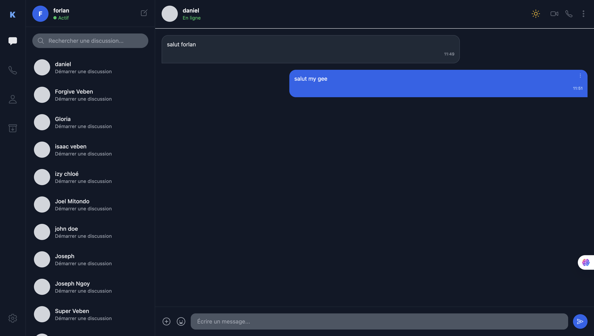

# 💬 Kadea Chat

Kadea Chat est une application de messagerie moderne, minimaliste et sécurisée conçue pour faciliter la communication entre les apprenants.


🔗 **[Voir le site en direct](https://veben-cmyk.github.io/Kadea-chat-Whatsaap_clone-/)**

## 🖼️ Aperçu 

---

## Fonctionnalités

✅ **Authentification utilisateur** (Connexion / Inscription)
✅ **Gestion sécurisée des sessions** (Stockage du token dans le `localStorage`)
✅ **Affichage dynamique du profil** connecté
✅ **Interface de chat 100% responsive**
✅ **Liste des utilisateurs et recherche en temps réel**
✅ **Envoi, modification et suppression de messages** via une API REST
✅ **Mode sombre / clair** avec mémorisation de la préférence
✅ **Déconnexion sécurisée** avec nettoyage du cache

---

## 📁 Structure du projet

```text
kadea-chat/
├── index.html          → Page d'accueil
├── login.html          → Page de connexion
├── register.html       → Page d'inscription
├── chat.html           → Interface principale de chat
├── profil.html         → Profil de l'utilisateur
├── js/
│   ├── login.js        → Logique d'authentification (connexion)
│   ├── register.js     → Logique d'authentification (inscription)
│   ├── profil.js       → Gestion du profil utilisateur
│   ├── chat.js          → Logique des discussions et messages
│   ├── theme.js          → Mode sombre / clair
│   └── helpers.js         → Fonctions utilitaires globales
├── images/
├── BUGS.md              → Suivi des bugs et corrections
└── README.md
```

> Toutes les pages `.html` sont à la racine du projet (les liens internes comme `href="login.html"` sont relatifs à la racine).

---

## Spécifications techniques & API

L'application communique avec une API externe en utilisant des requêtes asynchrones (`fetch`).

### Authentification
- `POST /auth/login` — obtenir le token d'accès
- `POST /auth/register` — créer un compte
- `GET /auth/me` — récupérer les informations de l'utilisateur connecté

Après une connexion réussie, le token est stocké localement :
```js
localStorage.setItem("token", token);
```
Il est ensuite injecté dans le header de chaque requête sécurisée :
```
Authorization: Bearer <TOKEN>
```

### Utilisateurs
- `GET /users` — liste des utilisateurs du workspace

### Conversations & messages
- `POST /conversations` — créer ou ouvrir une conversation privée
- `GET /conversations/:id/messages` — récupérer les messages d'une conversation
- `POST /conversations/:id/messages` — envoyer un message
- `PATCH /messages/:id` — modifier un message existant
- `DELETE /messages/:id` — supprimer un message

Toutes les requêtes incluent également une clé de workspace :
```
x-api-key: <API_KEY>
```

---

##  UI / UX & Responsive Design

- **Stack graphique** : Tailwind CSS pour un design fluide et moderne, Ionicons pour les icônes
- **Layout** : interface épurée fortement inspirée de WhatsApp
- 📱 **Mobile** : navigation adaptative — l'application alterne entre la liste des contacts et l'écran de discussion actif via un bouton de retour
- 💻 **Desktop** : affichage en écran séparé (sidebar de gauche + fenêtre de discussion principale)

---

## Installation et configuration

1. Cloner le projet
   ```bash
   git clone https://github.com/kadea-academy-learners/capstone-1-kadea-chat-clone-whatsapp-web-veben-cmyk.git
   cd capstone-1-kadea-chat-clone-whatsapp-web-veben-cmyk
   ```
2. Ouvrir `index.html` dans le navigateur, ou utiliser *Live Server* (VS Code)

> ℹ️ La clé API utilisée dans ce projet est une clé sandbox pédagogique (Kadea Academy), volontairement présente en clair dans le code pour cet exercice — voir [`BUGS.md`](BUGS.md) pour le détail.

---

## Workflow Git (Gitflow)

| Branche | Rôle |
|---|---|
| `main` | Code stable, prêt à être déployé/présenté |
| `develop` | Branche d'intégration des nouvelles fonctionnalités |
| `feature/*` | Une branche par fonctionnalité (ex: `feature/chat-core`) |
| `fix/*` | Correction de bug isolée |

Convention de commit : [Conventional Commits](https://www.conventionalcommits.org/) (`feat:`, `fix:`, `docs:`, `style:`...).


---

## 📌 Améliorations futures

- [ ] Créer les pages `appel.html` et `archive.html` (actuellement liens morts, voir `BUGS.md`)
- [ ] Indicateur de statut en ligne / hors ligne
- [ ] Envoi de fichiers multimédias (images, documents)
- [ ] Intégration de notifications en temps réel

---

## 👤 Auteur

**Veben Isaac**
- GitHub : [@veben-cmyk](https://github.com/veben-cmyk)
- LinkedIn : [Veben Isaac](https://www.linkedin.com/in/jaden-vben-6ab4093a9/)
